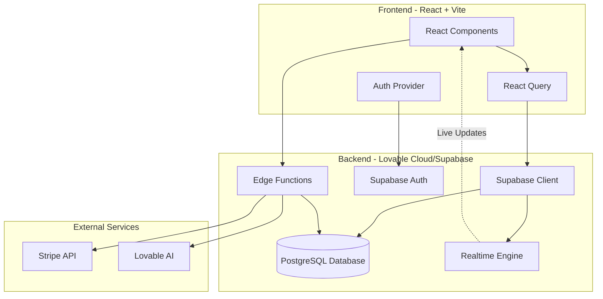
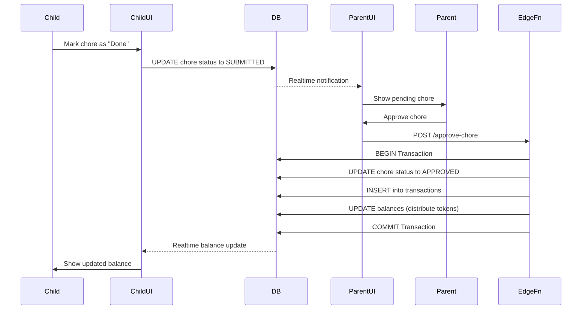
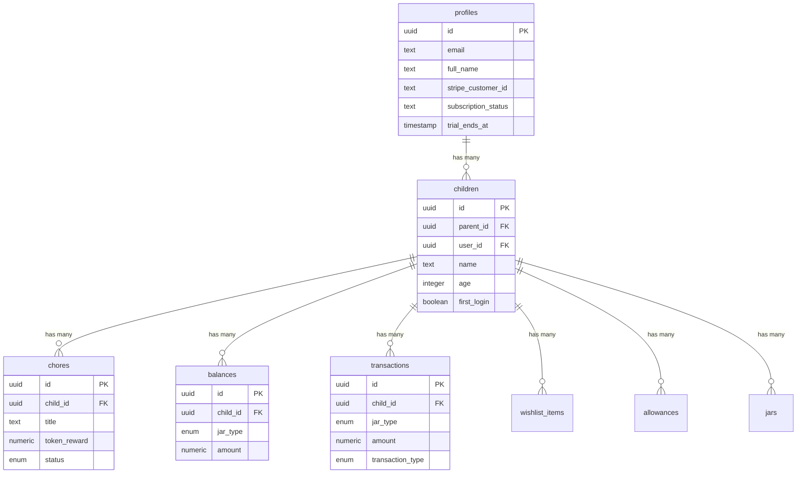

# FamilyBank 🏦

A modern full-stack web application for teaching children financial literacy through gamified allowances, chores, and savings management.


## 📋 Table of Contents

- [Overview](#overview)
- [Features](#features)
- [Architecture](#architecture)
- [Tech Stack](#tech-stack)
- [Getting Started](#getting-started)
- [Project Structure](#project-structure)
- [Database Schema](#database-schema)
- [API Documentation](#api-documentation)
- [Contributing](#contributing)

## 🎯 Overview

FamilyBank is an educational platform designed to help parents teach their children about money management in a fun, interactive way. Children earn tokens through completing chores, learn to allocate savings across different "jars" (savings goals), and receive AI-powered financial coaching.

### Key Highlights

- **Role-Based Access**: Separate dashboards for parents and children with appropriate permissions
- **Gamification**: Token-based reward system that converts to real money equivalents
- **AI Integration**: Personalized financial tips and coaching using Lovable AI
- **Real-Time Updates**: Live balance and chore status updates using Supabase Realtime
- **Subscription Model**: Stripe-powered premium features with trial period
- **Progressive Web App**: Installable on mobile and desktop with offline support
- **Push Notifications**: Real-time alerts for chore approvals, allowances, and wishlist updates

## ✨ Features

### For Parents
- ✅ Create and manage multiple child accounts
- ✅ Assign chores with token rewards
- ✅ Review and approve completed chores
- ✅ Manage weekly allowances with automatic processing
- ✅ Configure custom savings jar percentages
- ✅ Approve wishlist item purchases
- ✅ Track transaction history and analytics
- ✅ Subscription management with Stripe
- ✅ Push notifications for chore approvals and allowances
- ✅ Offline support with automatic sync

### For Children
- ✅ View and complete assigned chores
- ✅ Track token balance across multiple jars (Savings, Spending, Giving, Wishlist)
- ✅ Create and manage wishlist items
- ✅ Receive AI-powered financial coaching
- ✅ Submit chores for parent approval
- ✅ Real-time balance updates
- ✅ Install as a mobile or desktop app (PWA)
- ✅ Use app offline with automatic background sync

## 🏗️ Architecture

### System Architecture



### Data Flow - Chore Approval Process



### Database Entity Relationship



## 🛠️ Tech Stack

### Frontend
- **React 18** - UI library
- **TypeScript** - Type safety
- **Vite** - Build tool and dev server
- **TailwindCSS** - Utility-first styling
- **shadcn/ui** - Component library
- **React Router DOM** - Client-side routing
- **React Query** - Server state management
- **React Hook Form** - Form handling with validation
- **vite-plugin-pwa** - Progressive Web App support

### Backend (Lovable Cloud/Supabase)
- **PostgreSQL** - Primary database
- **Supabase Auth** - Authentication system
- **Row Level Security (RLS)** - Data access policies
- **Realtime** - Live data subscriptions
- **Edge Functions** - Serverless API endpoints (Deno runtime)
- **Push Notifications** - Web Push API with VAPID

### External Services
- **Stripe** - Payment processing and subscriptions
- **Lovable AI** - AI coaching features (GPT-4/Gemini)

### DevOps
- **GitHub** - Version control
- **Lovable** - Deployment platform
- **ESLint** - Code linting

## 🚀 Getting Started

### Prerequisites

- Node.js 18+ and npm
- Git
- A Lovable account (for deployment)
- Stripe account (for payment features)
- VAPID keys (optional, for push notifications)

### Installation

1. **Clone the repository**
   ```bash
   git clone <YOUR_GIT_URL>
   cd familybank
   ```

2. **Install dependencies**
   ```bash
   npm install
   ```

3. **Environment Setup**
   
   The project uses Lovable Cloud, which automatically configures:
   - `VITE_SUPABASE_URL`
   - `VITE_SUPABASE_PUBLISHABLE_KEY`
   - `VITE_SUPABASE_PROJECT_ID`

   For local development with Stripe, you'll need to add secrets via Lovable:
   - `STRIPE_SECRET_KEY`
   - `STRIPE_WEBHOOK_SECRET`

4. **Start development server**
   ```bash
   npm run dev
   ```

5. **Access the application**
   
   Open [http://localhost:5173](http://localhost:5173) in your browser

### Setting Up Push Notifications (Optional)

Push notifications enable real-time alerts for chore approvals, allowances, and wishlist updates.

1. **Generate VAPID Keys**
   ```bash
   npx web-push generate-vapid-keys
   ```
   Or use the online generator: https://vapidkeys.com/

2. **Add Secrets via Lovable**
   - `VAPID_PUBLIC_KEY` - Your public key
   - `VAPID_PRIVATE_KEY` - Your private key
   - `VITE_VAPID_PUBLIC_KEY` - Your public key (frontend)

3. **Test Notifications**
   - Log in as a parent
   - Click "Enable Notifications" when prompted
   - Approve a chore to receive a test notification

For detailed setup instructions, see [VAPID_SETUP.md](VAPID_SETUP.md)

### Progressive Web App Features

FamilyBank is installable as a Progressive Web App (PWA):

- **Installation**: Click the install button in your browser or visit `/install`
- **Offline Support**: The app works offline with automatic background sync
- **App-Like Experience**: Launch from home screen like a native app
- **Push Notifications**: Receive notifications even when the app is closed

**Supported Platforms**:
- ✅ Desktop (Chrome, Edge, Firefox)
- ✅ Android (Chrome, Samsung Internet)
- ✅ iOS (Safari - limited features)
- ✅ Windows, macOS, Linux

### Database Setup

The database schema is managed through Supabase migrations in `supabase/migrations/`. When you connect the project to Lovable Cloud, migrations are automatically applied.

Key tables:
- `profiles` - User account information
- `children` - Child profiles linked to parents
- `chores` - Task assignments
- `balances` - Token balances per jar type
- `transactions` - Financial transaction history
- `wishlist_items` - Child savings goals
- `allowances` - Automated weekly payments
- `push_subscriptions` - Web push notification subscriptions
- `notifications` - Notification history and delivery logs

## 📁 Project Structure

```
familybank/
├── src/
│   ├── components/          # Reusable React components
│   │   ├── ui/             # shadcn/ui components
│   │   ├── AICoach.tsx     # AI coaching interface
│   │   ├── NotificationPrompt.tsx  # Push notification opt-in
│   │   ├── OfflineIndicator.tsx    # Network status indicator
│   │   ├── InstallPWA.tsx  # PWA installation banner
│   │   └── ...
│   ├── pages/              # Route components
│   │   ├── Auth.tsx        # Parent authentication
│   │   ├── ChildAuth.tsx   # Child login
│   │   ├── ParentDashboard.tsx
│   │   ├── ChildDashboard.tsx
│   │   ├── Install.tsx     # PWA installation guide
│   │   └── ...
│   ├── hooks/              # Custom React hooks
│   │   ├── use-offline.ts  # Network status detection
│   │   └── ...
│   ├── lib/                # Utility functions
│   ├── integrations/       # External service integrations
│   │   └── supabase/       # Supabase client & types
│   ├── App.tsx             # Main app component & routing
│   └── main.tsx            # Application entry point
├── supabase/
│   ├── functions/          # Edge Functions
│   │   ├── ai-coach/       # AI coaching endpoint
│   │   ├── create-checkout/# Stripe checkout
│   │   ├── process-allowances/
│   │   ├── send-push-notification/  # Push notification sender
│   │   └── ...
│   └── migrations/         # Database migrations
├── public/                 # Static assets
│   ├── pwa-192x192.png    # PWA icon (192x192)
│   ├── pwa-512x512.png    # PWA icon (512x512)
│   ├── apple-touch-icon.png  # iOS icon
│   └── robots.txt
├── VAPID_SETUP.md         # Push notification setup guide
└── [config files]          # Vite, TypeScript, Tailwind configs
```

## 🗄️ Database Schema

### Core Tables

#### `profiles`
Stores parent user information and subscription details.
- Links to Supabase Auth users
- Manages Stripe customer relationships
- Tracks subscription and trial status

#### `children`
Child accounts created by parents.
- Each child has a unique `user_id` for authentication
- Links to parent via `parent_id`
- Stores age, settings, and initial credentials

#### `balances`
Current token balances for each jar type.
- Four jar types: `SAVINGS`, `SPENDING`, `GIVING`, `WISHLIST`
- Real-time updates via Supabase Realtime
- Enforces non-negative balances

#### `transactions`
Complete audit trail of all token movements.
- Types: `CHORE`, `ALLOWANCE`, `WITHDRAWAL`, `WISHLIST_PURCHASE`
- Immutable records for accountability
- Links to reference entities (chores, wishlist items)

### Security

All tables are protected by Row Level Security (RLS) policies:
- Parents can only access their own children's data
- Children can only view/modify their own records
- Sensitive operations require authentication
- Database triggers prevent unauthorized modifications

## 📡 API Documentation

### Edge Functions

#### `POST /ai-coach`
Get personalized financial advice for a child.
```typescript
// Request
{
  childId: string,
  question: string
}

// Response
{
  response: string,
  suggestions?: string[]
}
```

#### `POST /create-checkout`
Create a Stripe checkout session.
```typescript
// Request
{
  priceId: string,
  successUrl: string,
  cancelUrl: string
}

// Response
{
  sessionUrl: string
}
```

#### `POST /process-allowances`
Automated function to process weekly allowances (scheduled via cron).

#### `POST /approve-wishlist-item`
Approve a child's wishlist purchase.
```typescript
// Request
{
  itemId: string
}

// Response
{
  success: boolean,
  newBalance: number
}
```

## 🧪 Testing

```bash
# Run linter
npm run lint

# Build for production
npm run build

# Preview production build
npm run preview
```

## 🚢 Deployment

### Via Lovable (Recommended)

1. Visit [Lovable Project](https://lovable.dev/projects/a7016775-175a-4f9b-bd1f-fa45802da9d5)
2. Click **Publish** button (top right)
3. Click **Update** to deploy frontend changes

Note: Backend changes (Edge Functions, migrations) deploy automatically.

### Via GitHub & Self-Hosting

The project can be deployed to any static hosting service:
- Vercel
- Netlify
- Cloudflare Pages
- AWS Amplify

See [Self-Hosting Guide](https://docs.lovable.dev/tips-tricks/self-hosting) for details.

## 🔐 Environment Variables

Required secrets (configured via Lovable Secrets Manager):
- `STRIPE_SECRET_KEY` - Stripe API secret key
- `STRIPE_WEBHOOK_SECRET` - Stripe webhook signing secret

Auto-configured by Lovable Cloud:
- `VITE_SUPABASE_URL`
- `VITE_SUPABASE_PUBLISHABLE_KEY`
- `VITE_SUPABASE_PROJECT_ID`

## 🤝 Contributing

1. Fork the repository
2. Create a feature branch (`git checkout -b feature/amazing-feature`)
3. Commit your changes (`git commit -m 'Add amazing feature'`)
4. Push to the branch (`git push origin feature/amazing-feature`)
5. Open a Pull Request

## 📄 License

This project is built with [Lovable](https://lovable.dev) and follows standard web application licensing.

## 🙏 Acknowledgments

- [shadcn/ui](https://ui.shadcn.com/) for the beautiful component library
- [Supabase](https://supabase.com/) for the backend infrastructure
- [Lovable](https://lovable.dev/) for the development platform
- [Stripe](https://stripe.com/) for payment processing

## 📞 Contact

For questions or feedback, please open an issue on GitHub.

---

Built with ❤️ using [Lovable](https://lovable.dev)
