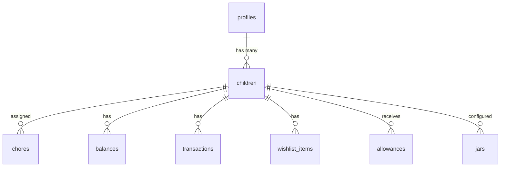
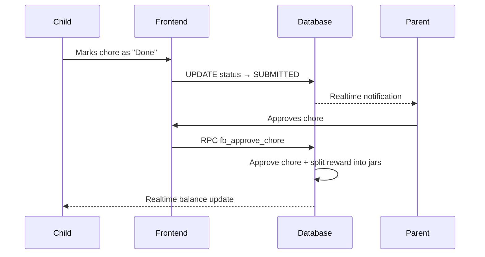

# FamilyBank 🏦

A modern full-stack SaaS platform for teaching children financial literacy through gamified allowances, chores, savings management, and AI-powered coaching.


**Live product:** https://familybank.lovable.app  
**GitHub repo:** https://github.com/anushayatirajula-lab/familybank

---

## Why I Built This

Traditional financial literacy tools for children lack structured workflows, feedback loops, and age-appropriate guidance. FamilyBank solves this by combining a full-stack SaaS architecture with LLM-powered coaching, real-time state-driven UX, and subscription infrastructure.

---

## Core Technical Highlights

### Full-Stack Architecture

Built a complete production system spanning frontend, backend, database design, authentication, AI integration, and payment infrastructure.

| Layer | Technology |
|-------|-----------|
| **Frontend** | React, TypeScript, TailwindCSS, Vite, shadcn/ui |
| **Backend** | Supabase (PostgreSQL, Auth, Edge Functions, Realtime) |
| **AI** | Lovable AI Gateway (Google Gemini 2.5 Flash) with age-adaptive prompts and financial context injection |
| **Payments** | Stripe (subscriptions, trials, checkout, customer portal) |
| **Deployment** | PWA with offline support, push notifications, installable on mobile/desktop |

### System Architecture

```
Client (React / TypeScript / PWA)
        ↓
Supabase Client SDK (Auth + Realtime + REST)
        ↓
PostgreSQL (RLS-protected tables + SECURITY DEFINER RPCs)
        ↓
Edge Functions (Deno serverless)
    ├── AI Coach (LLM prompt pipelines with child financial context)
    ├── Stripe billing (checkout, webhooks, portal)
    ├── Allowance processing (daily cron)
    ├── Recurring chore generation (daily cron)
    ├── Trial reminders (daily cron)
    └── Push notifications (Web Push API)
```

---

## Key Features

### For Parents
- Create and manage multiple child accounts with secure authentication
- Assign chores with token rewards; review and approve submissions
- Configure weekly allowances with automated processing
- Set up recurring chores that regenerate daily or weekly
- Customize savings jar percentages per child
- Approve wishlist item purchases and cash out non-wishlist jar balances
- Track transaction history and spending analytics
- Reset child passwords directly from the dashboard
- Subscription management via Stripe

### For Children
- View and complete assigned chores
- Track token balances across multiple jars (Books, Shopping, Charity, Wishlist, Savings)
- Create and manage wishlist items with savings goals
- Receive age-appropriate, context-aware AI-powered financial coaching
- Real-time balance updates via Supabase Realtime

---

## AI Coaching System

The platform includes an LLM-powered financial coaching feature for children, implemented as a Supabase Edge Function.

**How it works:**

1. Child or parent initiates a coaching session (lesson, quiz, or chat mode)
2. The edge function verifies authentication and authorization (parent or child ownership)
3. An age-adaptive system prompt is selected based on the child's age bracket (6–8, 9–11, 12+)
4. The child's live financial context (jar balances, wishlist goals, recent transactions, and allowance schedule) is injected into the prompt
5. The conversation history and personalized system prompt are sent to the LLM (Google Gemini 2.5 Flash via the Lovable AI Gateway)
6. The response is returned to the client in real-time

**Design decisions:**
- **Age-adaptive prompts:** Three distinct prompt templates tailored to developmental stages
- **Context-aware personalization:** Real-time balances, savings goals, transactions, and allowance schedule are woven into coaching responses
- **Mode-based behavior:** Lessons teach concepts, quizzes test understanding, chat answers questions
- **Safety guardrails:** Prompts explicitly exclude complex financial topics (investing, debt, credit cards)
- **Stateless execution:** Each request is self-contained; conversation history is managed client-side
- **Usage limits:** Free-tier users get 10 AI coach sessions per month; Premium unlocks unlimited usage

---

## Backend Engineering

### Database Schema

Designed a relational schema with the following core tables:

| Table | Purpose |
|-------|---------|
| `profiles` | Parent user accounts, linked to Supabase Auth |
| `children` | Child profiles linked to parents, with auth credentials |
| `chores` | Task assignments with status tracking (pending → submitted → approved) |
| `balances` | Token balances per jar type per child |
| `transactions` | Immutable audit trail of all token movements |
| `wishlist_items` | Savings goals with progress tracking |
| `allowances` | Automated weekly payment configuration |
| `jars` | Customizable percentage allocation per child |
| `subscription_data` | Stripe subscription state |
| `push_subscriptions` | Web Push notification endpoints |
| `notifications` | Notification history |
| `user_roles` | Role assignments (`PARENT` / `CHILD`) for authorization |

### Entity Relationship Diagram


```mermaid
erDiagram
    profiles ||--o{ children : "has many"
    children ||--o{ chores : "assigned"
    children ||--o{ balances : "has"
    children ||--o{ transactions : "has"
    children ||--o{ wishlist_items : "has"
    children ||--o{ allowances : "receives"
    children ||--o{ jars : "configured"
```

### Security

- **Row Level Security (RLS):** All tables are protected; parents can only access their own children's data, children can only access their own records
- **Authentication isolation:** Separate auth flows for parents (email/password) and children (username + family code + password backed by an internal Supabase Auth user)
- **Server-side validation:** Edge functions verify JWT tokens and ownership before any mutation
- **Role-based access:** `user_roles` table with PARENT/CHILD enum enforces access control
- **Parent email privacy:** Parent emails are not stored in the `profiles` table; they are fetched dynamically via the Supabase Auth Admin API
- **Plain-dollar amounts:** All monetary values are stored as plain dollars (no multiplier) and formatted as `$X.XX`

### API Design (Edge Functions)

| Endpoint | Purpose |
|----------|---------|
| `POST /ai-coach` | Context-aware, age-adaptive financial coaching via LLM |
| `POST /create-checkout` | Stripe checkout session creation |
| `POST /customer-portal` | Stripe customer portal redirect |
| `POST /check-subscription` | Subscription status verification |
| `POST /process-allowances` | Automated weekly allowance distribution (cron) |
| `POST /process-recurring-chores` | Recurring chore generation (cron) |
| `POST /send-trial-reminder` | Day-10 Premium trial reminder (email + push) |
| `POST /approve-wishlist-item` | Wishlist purchase approval with balance deduction |
| `POST /send-push-notification` | Web Push notification delivery |
| `POST /get-vapid-key` | VAPID public key for push subscriptions |
| `POST /parent-reset-child-password` | Parent-initiated child password reset |
| `POST /reset-child-password` | Direct child password reset |
| `POST /send-child-credentials` | Email child login credentials to parent |
| `POST /delete-child-profile` | Cascade delete child profile and auth user |
| `POST /cleanup-old-chores` | Maintenance: remove stale chore records |
| `POST /cleanup-orphaned-auth-users` | Maintenance: remove orphaned auth entries |

### Database RPCs (SECURITY DEFINER)

Core business logic is encapsulated in PostgreSQL functions to ensure consistent, secure operations:

| Function | Purpose |
|----------|---------|
| `fb_process_due_allowance(uuid)` | Atomically distributes a due weekly allowance into jars and advances the next payment date |
| `fb_verify_cron_secret(text)` | Validates the `X-Cron-Secret` header against `vault.decrypted_secrets` |
| `fb_approve_chore(uuid)` | Atomically approves a submitted chore and splits its reward into jars |
| `fb_submit_chore(uuid)` | Moves a chore from PENDING to SUBMITTED for parent review |
| `fb_spend_wishlist(uuid)` | Atomic wishlist purchase: deducts balances, marks the item purchased, and records a transaction |
| `fb_increment_ai_coach_usage(uuid)` | Tracks monthly AI coach usage for free-tier limits |
| `get_user_tier(uuid)` | Returns the effective subscription tier (`free`, `premium`, etc.) |

---

## Payment & Subscription Infrastructure

Integrated Stripe for production billing:

- Subscription lifecycle management (create, update, cancel)
- Free trial periods (configurable duration)
- Stripe Checkout for secure payment collection
- Customer portal for self-service subscription management
- Subscription status synced to database via `subscription_data` table
- Trial end dates tracked in `profiles.trial_ends_at` with a `send-trial-reminder` cron on day 10
- Gated features based on subscription status (automated allowances and recurring chores are Premium-only)

---

## Progressive Web App (PWA)

- Installable on mobile and desktop (Chrome, Edge, Safari, Firefox)
- Offline support with service worker caching
- Push notifications for chore approvals, allowances, wishlist updates, and trial reminders
- App-like experience when launched from home screen
- Dedicated `/install` page with platform-specific instructions
- In-app update prompt so users can refresh to the latest version

---

## Data Flow Example: Chore Approval


```mermaid
sequenceDiagram
    participant Child
    participant Frontend
    participant Database
    participant Parent

    Child->>Frontend: Marks chore as "Done"
    Frontend->>Database: UPDATE status → SUBMITTED
    Database-->>Parent: Realtime notification
    Parent->>Frontend: Approves chore
    Frontend->>Database: RPC fb_approve_chore
    Database->>Database: Approve chore + split reward into jars
    Database-->>Child: Realtime balance update
```

---

## Engineering Challenges Solved

- **Multi-role authentication:** Separate auth flows for parents (email/password) and children (username + family code + password) within a single Supabase Auth instance
- **Automated financial workflows:** `pg_cron` + `pg_net` schedules trigger Edge Functions daily:
  - `process-allowances` runs at 00:00 UTC, distributing weekly allowances and notifying parents
  - `process-recurring-chores` runs at 00:05 UTC, spawning daily/weekly chore instances
  - `send-trial-reminder` runs daily, sending day-10 Premium trial reminders
  - Cron calls are authenticated with an `X-Cron-Secret` header stored in `vault.decrypted_secrets` and verified via the `fb_verify_cron_secret` RPC
- **Real-time UX:** Supabase Realtime subscriptions for live balance and chore status updates
- **Secure multi-tenant isolation:** RLS policies ensuring strict data isolation between families
- **Offline-first PWA:** Service worker caching with background sync for offline usage
- **Server-side business logic:** Sensitive operations (allowance distribution, wishlist purchases, usage counting) are executed inside SECURITY DEFINER PostgreSQL functions

---

## Project Structure

```
src/
├── components/          # Reusable React components
│   ├── ui/              # shadcn/ui base components
│   ├── AICoach.tsx       # AI coaching chat interface
│   ├── AllowanceManager.tsx
│   ├── CashOutDialog.tsx
│   ├── SpendingInsights.tsx
│   └── ...
├── pages/               # Route-level page components
│   ├── Auth.tsx          # Parent login/signup
│   ├── ChildAuth.tsx     # Child login (username + family code + password)
│   ├── ParentDashboard.tsx
│   ├── ParentChildDetail.tsx  # Child profile & settings
│   ├── ChildDashboard.tsx
│   ├── ChildWishlist.tsx
│   ├── Pricing.tsx       # Subscription plans
│   ├── Install.tsx       # PWA installation guide
│   ├── ResetPassword.tsx
│   ├── UpdatePassword.tsx
│   ├── DeveloperDocs.tsx
│   └── ...
├── hooks/               # Custom React hooks
├── integrations/        # Supabase client & generated types
└── lib/                 # Utility functions

supabase/
├── functions/           # Edge Functions (Deno runtime)
│   ├── ai-coach/
│   ├── create-checkout/
│   ├── process-allowances/
│   ├── process-recurring-chores/
│   ├── send-trial-reminder/
│   ├── send-push-notification/
│   └── ...
└── migrations/          # Database migration files
```

---

## Key Skills Demonstrated

- Full-stack TypeScript engineering (React + Supabase + Deno)
- Relational database design with PostgreSQL
- Row Level Security (RLS) policy design
- RESTful API design with serverless edge functions
- LLM integration with age-adaptive prompt engineering and real-time context injection
- Stripe payment/subscription integration
- PWA development with offline support and push notifications
- Real-time data synchronization
- Production SaaS deployment

---

*Note: Context-aware AI coaching and spending analytics dashboards have been implemented and are no longer planned improvements. They are documented in the sections above.*

---

## Evaluation Workflow

FamilyBank includes a lightweight evaluation suite under `evals/familybank/` for AI Coach and backend workflow regression testing.

### Braintrust setup

1. Create a Braintrust project named `FamilyBank Evaluations`.
2. Import `evals/familybank/ai-coach-cases.jsonl` as an AI Coach dataset.
3. Import `evals/familybank/workflow-cases.json` as workflow test documentation or convert each item into an experiment case.
4. For AI Coach cases, call the `ai-coach` function with each case's `input.childAge`, `input.message`, and `mode`.
5. Score outputs for forbidden topics, dollar accuracy, age appropriateness, response length, and required personalization.

### Local regression check

Save captured outputs in this shape:

```json
{
  "ai_balance_accuracy": {
    "response": "You have $40.00 total..."
  },
  "wishlist_atomic_spend": {
    "usesRpc": "fb_spend_wishlist",
    "balanceNeverNegative": true,
    "marksPurchased": true,
    "recordsTransaction": true
  }
}
```

Then run:

```bash
node scripts/run-familybank-evals.mjs evals/familybank/sample-outputs.json
```

The runner exits non-zero when any case fails, so it can be used before prompt, database, or workflow changes.

---

Built with [Lovable](https://lovable.dev)
