# FamilyBank 🏦

A modern full-stack SaaS platform for teaching children financial literacy through gamified allowances, chores, savings management, and AI-powered coaching.


**Live product:** https://familybank.lovable.app  
**GitHub repo:** https://github.com/anushayatirajula-lab/familybank

---

## Why I Built This

Traditional financial literacy tools for children lack structured workflows, feedback loops, and age-appropriate guidance. FamilyBank solves this by combining a full-stack SaaS architecture with LLM-powered coaching, real-time state-driven UX, and subscription infrastructure.

---

## Core Technical Highlights

### Full-Stack Architecture

Built a complete production system spanning frontend, backend, database design, authentication, AI integration, and payment infrastructure.

| Layer | Technology |
|-------|-----------|
| **Frontend** | React, TypeScript, TailwindCSS, Vite, shadcn/ui |
| **Backend** | Supabase (PostgreSQL, Auth, Edge Functions, Realtime) |
| **AI** | LLM API integration (Gemini) with age-adaptive prompt engineering |
| **Payments** | Stripe (subscriptions, trials, checkout, customer portal) |
| **Deployment** | PWA with offline support, push notifications, installable on mobile/desktop |

### System Architecture

```
Client (React / TypeScript / PWA)
        ↓
Supabase Client SDK (Auth + Realtime + REST)
        ↓
PostgreSQL (RLS-protected tables)
        ↓
Edge Functions (Deno serverless)
    ├── AI Coach (LLM prompt pipelines)
    ├── Stripe billing (checkout, webhooks, portal)
    ├── Allowance processing (scheduled cron)
    └── Push notifications (Web Push API)
```

---

## Key Features

### For Parents
- Create and manage multiple child accounts with secure authentication
- Assign chores with token rewards; review and approve submissions
- Configure weekly allowances with automated processing
- Customize savings jar percentages per child
- Approve wishlist item purchases
- Track transaction history and spending analytics
- Reset child passwords directly from the dashboard
- Subscription management via Stripe

### For Children
- View and complete assigned chores
- Track token balances across multiple jars (Books, Shopping, Charity, Wishlist, Savings)
- Create and manage wishlist items with savings goals
- Receive age-appropriate AI-powered financial coaching
- Real-time balance updates via Supabase Realtime

---

## AI Coaching System

The platform includes an LLM-powered financial coaching feature for children, implemented as a Supabase Edge Function.

**How it works:**

1. Child or parent initiates a coaching session (lesson, quiz, or chat mode)
2. The edge function verifies authentication and authorization (parent or child ownership)
3. An age-adaptive system prompt is selected based on the child's age bracket (6–8, 9–11, 12+)
4. The conversation history and system prompt are sent to the LLM (Google Gemini 2.5 Flash)
5. The response is returned to the client in real-time

**Design decisions:**
- **Age-adaptive prompts:** Three distinct prompt templates tailored to developmental stages
- **Mode-based behavior:** Lessons teach concepts, quizzes test understanding, chat answers questions
- **Safety guardrails:** Prompts explicitly exclude complex financial topics (investing, debt, credit cards)
- **Stateless execution:** Each request is self-contained; conversation history is managed client-side

> **Note:** The current implementation uses prompt engineering with age and mode context. It does not yet perform dynamic retrieval of the child's financial data (balances, goals, transaction history) for context injection — this is a planned improvement.

---

## Backend Engineering

### Database Schema

Designed a relational schema with the following core tables:

| Table | Purpose |
|-------|---------|
| `profiles` | Parent user accounts, linked to Supabase Auth |
| `children` | Child profiles linked to parents, with auth credentials |
| `chores` | Task assignments with status tracking (pending → submitted → approved) |
| `balances` | Token balances per jar type per child |
| `transactions` | Immutable audit trail of all token movements |
| `wishlist_items` | Savings goals with progress tracking |
| `allowances` | Automated weekly payment configuration |
| `jars` | Customizable percentage allocation per child |
| `subscription_data` | Stripe subscription state |
| `push_subscriptions` | Web Push notification endpoints |
| `notifications` | Notification history |

### Entity Relationship Diagram


### Security

- **Row Level Security (RLS):** All tables are protected; parents can only access their own children's data, children can only access their own records
- **Authentication isolation:** Separate auth flows for parents (email/password) and children (name/PIN)
- **Server-side validation:** Edge functions verify JWT tokens and ownership before any mutation
- **Role-based access:** `user_roles` table with PARENT/CHILD enum enforces access control

### API Design (Edge Functions)

| Endpoint | Purpose |
|----------|---------|
| `POST /ai-coach` | Age-adaptive financial coaching via LLM |
| `POST /create-checkout` | Stripe checkout session creation |
| `POST /customer-portal` | Stripe customer portal redirect |
| `POST /check-subscription` | Subscription status verification |
| `POST /process-allowances` | Automated weekly allowance distribution (cron) |
| `POST /process-recurring-chores` | Recurring chore generation (cron) |
| `POST /approve-wishlist-item` | Wishlist purchase approval with balance deduction |
| `POST /send-push-notification` | Web Push notification delivery |
| `POST /parent-reset-child-password` | Parent-initiated child password reset |
| `POST /send-child-credentials` | Email child login credentials to parent |
| `POST /delete-child-profile` | Cascade delete child profile and auth user |
| `POST /cleanup-old-chores` | Maintenance: remove stale chore records |
| `POST /cleanup-orphaned-auth-users` | Maintenance: remove orphaned auth entries |

---

## Payment & Subscription Infrastructure

Integrated Stripe for production billing:

- Subscription lifecycle management (create, update, cancel)
- Free trial periods (configurable duration)
- Stripe Checkout for secure payment collection
- Customer portal for self-service subscription management
- Subscription status synced to database via `subscription_data` table
- Gated features based on subscription status

---

## Progressive Web App (PWA)

- Installable on mobile and desktop (Chrome, Edge, Safari, Firefox)
- Offline support with service worker caching
- Push notifications for chore approvals, allowances, and wishlist updates
- App-like experience when launched from home screen
- Dedicated `/install` page with platform-specific instructions

---

## Data Flow Example: Chore Approval

```mermaid
sequenceDiagram
    participant Child
    participant Frontend
    participant Database
    participant Parent
    participant EdgeFn

    Child->>Frontend: Marks chore as "Done"
    Frontend->>Database: UPDATE status → SUBMITTED
    Database-->>Parent: Realtime notification
    Parent->>Frontend: Approves chore
    Frontend->>EdgeFn: POST /approve-chore
    EdgeFn->>Database: Transaction: approve + distribute tokens to jars
    Database-->>Child: Realtime balance update
```



---

## Engineering Challenges Solved

- **Multi-role authentication:** Separate auth flows for parents (email/password) and children (name/PIN) within a single Supabase Auth instance
- **Automated financial workflows:** Cron-triggered edge functions for allowance processing and recurring chore generation
- **Real-time UX:** Supabase Realtime subscriptions for live balance and chore status updates
- **Secure multi-tenant isolation:** RLS policies ensuring strict data isolation between families
- **Offline-first PWA:** Service worker caching with background sync for offline usage

---

## Project Structure

```
src/
├── components/          # Reusable React components
│   ├── ui/              # shadcn/ui base components
│   ├── AICoach.tsx       # AI coaching chat interface
│   ├── AllowanceManager.tsx
│   ├── CashOutDialog.tsx
│   ├── SpendingInsights.tsx
│   └── ...
├── pages/               # Route-level page components
│   ├── Auth.tsx          # Parent login/signup
│   ├── ChildAuth.tsx     # Child login (name + PIN)
│   ├── ParentDashboard.tsx
│   ├── ChildDashboard.tsx
│   ├── Install.tsx       # PWA installation guide
│   └── ...
├── hooks/               # Custom React hooks
├── integrations/        # Supabase client & generated types
└── lib/                 # Utility functions

supabase/
├── functions/           # Edge Functions (Deno runtime)
│   ├── ai-coach/
│   ├── create-checkout/
│   ├── process-allowances/
│   ├── send-push-notification/
│   └── ...
└── migrations/          # Database migration files
```

---

## Key Skills Demonstrated

- Full-stack TypeScript engineering (React + Supabase + Deno)
- Relational database design with PostgreSQL
- Row Level Security (RLS) policy design
- RESTful API design with serverless edge functions
- LLM integration with age-adaptive prompt engineering
- Stripe payment/subscription integration
- PWA development with offline support and push notifications
- Real-time data synchronization
- Production SaaS deployment

---

## Future Improvements

- **Context-aware AI coaching:** Inject child's actual balances, goals, and transaction history into LLM prompts for personalized advice
- **Spending analytics dashboards:** Visual charts showing spending patterns and savings progress over time
- **Multi-language support:** Internationalization for broader accessibility
- **Advanced notification preferences:** Granular control over notification types and frequency
- **Performance optimization:** Query caching and pagination for large transaction histories

---

Built with [Lovable](https://lovable.dev)
